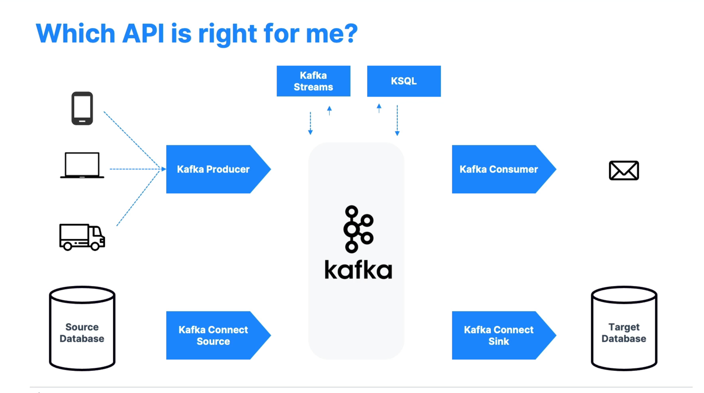

## Notes
Start Kafka Cluster(locally): 
Zookeeper: /usr/local/bin/zookeeper-server-start /usr/local/etc/zookeeper/zoo.cfg 
Kafka: /usr/local/bin/kafka-server-start /usr/local/etc/kafka/server.properties
Create Topic: kafka-topics --create --topic demo-first-topic --bootstrap-server localhost:9092 --partitions 3 --replication-factor 1


Steps to set up free cloud kafka playground can be found [here](https://www.conduktor.io/alternatives-for-conduktor-playground/) 
and docker-compose to bring up conduktor UI can be found [here](kafka-material/docker-compose.yml)

To setup SSL
```aidl
 openssl s_client -connect rich-starfish-14365-eu1-kafka.upstash.io:9092 -servername rich-starfish-14365-eu1-kafka.upstash.io
 rm upstashca.p12 upstashca.der 
 openssl x509 -outform der -in upstashca.pem -out upstashca.der
 keytool -import -alias upstashca -file upstashca.pem -keystore upstashca.p12
```



### Kafka Schema Registry
Kafka Schema Registry is an essential component for managing schemas in a 
Kafka-based data pipeline. It ensures compatibility, centralizes schema management, 
and supports schema evolution, making it easier to maintain data consistency and integrity across producers and consumers.

### Partitions
We have to be careful with the number of partitions we choose at the beginning, as 
changing the number of partitions will have an impact on the ordering of the events
i.e. we can no longer guarantee messages with same key will go to same partition as
Utils.toPositive(Utils.murmur2(serializedKey)) % numPartitions;

Having high partitions will let us achieve more parallelism and high consumers in a consumer group but 
Having a very high number of partitions can lead to increased resource consumption, more files opened, longer recovery times,
network overhead, management complexity, consumer impact, and garbage collection pressure

We have to understand our peak throughput and max load each
partition can handle and choose accordingly. We can maybe get started with,
```
Small Cluster ( < 6 brokers) then have around 3* number of brokers,
Large cluster (> 12 brokers)  then have around 2 * number of brokers
```
Note: Adding brokers will not distribute the existing data to new brokers automatically, 
we have to do it manually by adjusting partitions.

Topics -> partition -> segment (Each segment in a Kafka partition consists of multiple files: a .log file for the message data, an .index file for offset indexing, a .timeindex file for time-based indexing, and an optional .txnindex file for transactions.)

### Replication Factor:
If we increase RF, then it will increase the load of the existing brokers, 
as it needs more disk space in the existing cluster and also network i/o and it may impact on our performance.

So, we have atleast RF as 2, but recommended is 3 and at max 4.

Higher RF -> 
1. Better durability ( N-1 brokers can fail)
2. Better availability ( N - min.insync.replica , if acks = all)
3. High latency and more disk space and more network i/o

### Important configuration
1. log.segment.bytes, log.segment.ms can control the max segment size, max time to wait before creating a new one
2. log.cleanup.policy -> determines the strategy Kafka uses to clean up log segments once they reach their retention limits (defined by size or time) delete / compact
3. log.retention.ms / log.retention.bytes -> max time/bytes we want to store
4. Log Compact delete policy -> Retains the latest value for each key in a topic, removing older records with the same key. Useful in stateful services, changelog topics for stream processing, and event sourcing systems.
5. unclean.leader.election.enable -> Controls whether Kafka allows a follower that may not be fully caught up to become the leader. Enabled when we want to Prioritize availability over consistency, risking data loss.
6. By Default, max size of a message is 1MB. If we want to send more we need to edit config values at producer, consumer, topic config, broker. We can also may be send/upload in S3/Blob storage and add link in the message
