## Architecture

Overview of kafka Architecture
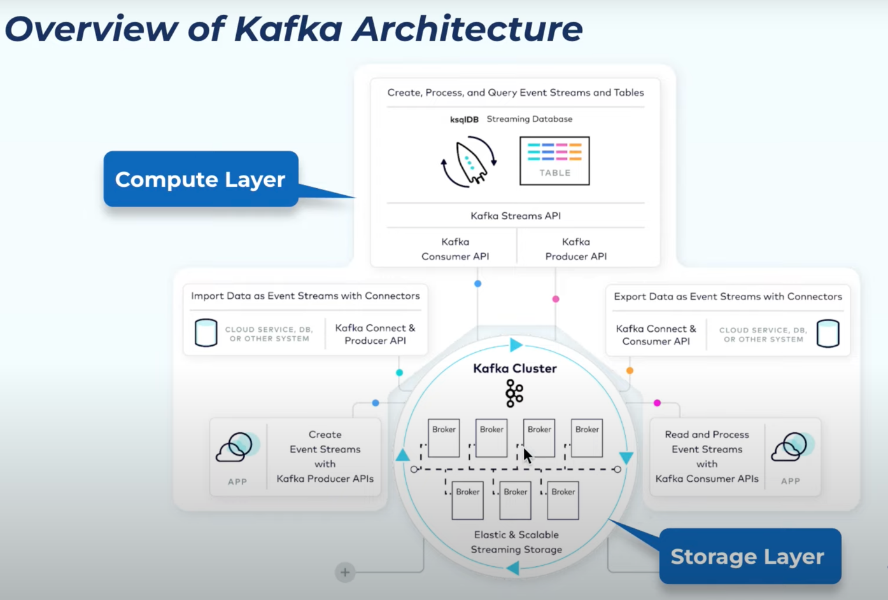

Here is how each event/record looks like, Headers are optional. 
We can add meta data here to headers, to filter the data, custom serialization, debugging, versioning etc

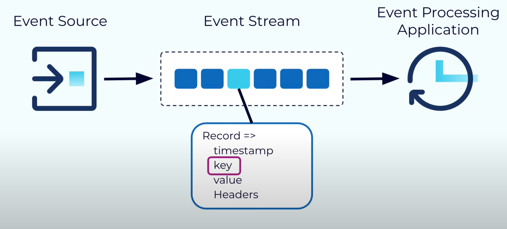

**Kafka Schema Registry** is a centralized service for managing and enforcing schemas for the data (messages) that Kafka producers send to Kafka topics. 
It is part of the Confluent Platform, which is an extension of Apache Kafka. The Schema Registry allows producers to define schemas 
(usually in Avro, JSON Schema, or Protobuf) and ensures that the data sent by producers and consumed by consumers is compliant with these schemas. 

This is how, value looks/gets serialized if we have integrated with schema registry using avro serializer,
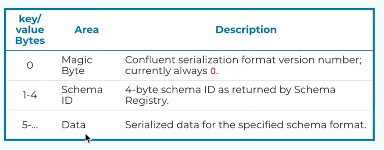

Now, Lets look into Kafka Broker,

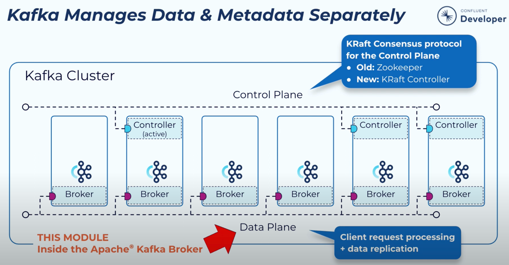

### Clients Requests

**Produce Request**: 
Producer use a configurable partitioner to determine the topic partition to assign to the record using the key if present.
Sending records one at a time would be inefficient due to the overhead of repeated network requests. So, the producer will accumulate the records assigned to a given partition into batches. 
Batching also provides for much more effective compression, when compression is used. 

Batching is controlled by two properties i.e linger.ms, batch.size. So once enough time or enough data has been accumulated in those record batches, those record batches will be drained, and will form a produce request. 
And this produce request will then be sent to the broker that is the leader of the included partitions.
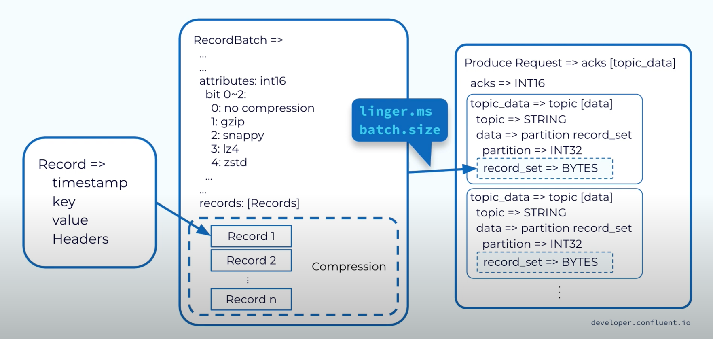

The request first lands in the broker’s socket receive buffer where it will be picked up by a network thread from the pool. 
That network thread will handle that particular client request through the rest of its lifecycle. 
The network thread will read the data from the socket buffer, form it into a produce request object, and add it to the request queue.

Next, a thread from the I/O thread pool will pick up the request from the queue. 
The I/O thread will perform some validations, including a CRC check of the data in the request. 
It will then append the data to the physical data structure of the partition, which is called a commit log.

On disk, the commit log is organized as a collection of segments. Each segment is made up of several files. 
One of these, a .log file, contains the event data. A second, a .index file, contains an index structure, which maps from a record offset to the position of that record in the .log file.
We also have .timeindex (map timestamps to offsets) , txnindex (used for managing transactional messages, ensuring that messages within a transaction are processed atomically.)

Since the log data is not flushed from the page cache to disk synchronously, Kafka relies on replication to multiple broker nodes, 
in order to provide durability. By default, the broker will not acknowledge the produce request until it has been replicated to other brokers.

To avoid tying up the I/O threads while waiting for the replication step to complete, the request object will be stored in a map-like data structure called purgatory (it’s where things go to wait).

Once the request has been fully replicated, the broker will take the request object out of purgatory, generate a response object, and place it on the response queue.

From the response queue, the network thread will pick up the generated response, and send its data to the socket send buffer. The network thread also enforces ordering of requests from an individual 
client by waiting for all of the bytes for a response from that client to be sent before taking another object from the response queue.
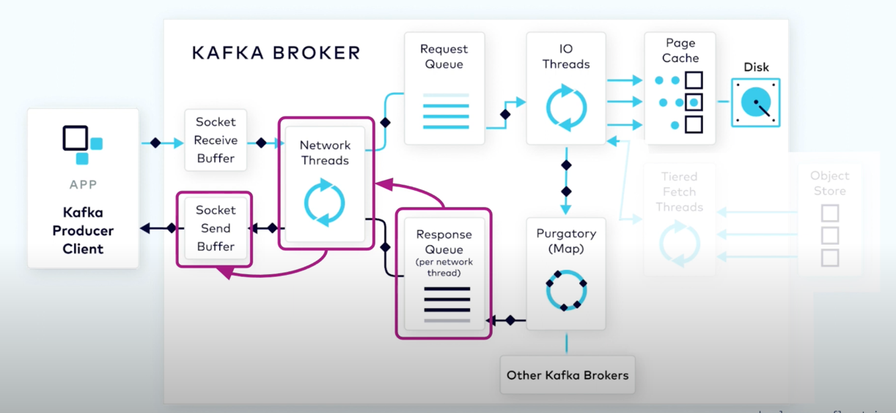

**Fetch Request:**
In order to consume records, a consumer client sends a fetch request to the broker, specifying the topic, partition, and offset it wants to consume. The fetch request goes to the broker’s socket receive buffer where it is picked up by a network thread. The network thread puts the request in the request queue, as was done with the produce request.

The I/O thread will take the offset that is included in the fetch request and compare it with the .index file that is part of the partition segment. 
That will tell it exactly the range of bytes that need to be read from the corresponding .log file to add to the response object.

However, it would be inefficient to send a response with every record fetched, or even worse, when there are no records available. To be more efficient, consumers can be configured to wait for a minimum number of bytes of data, or to wait for a maximum amount of time before returning a response to a fetch request. 
While waiting for these criteria to be met, the fetch request is sent to purgatory.

Once the size or time requirements have been met, the broker will take the fetch request out of purgatory and generate a response to be sent back to the client. The rest of the process is the same as the produce request.

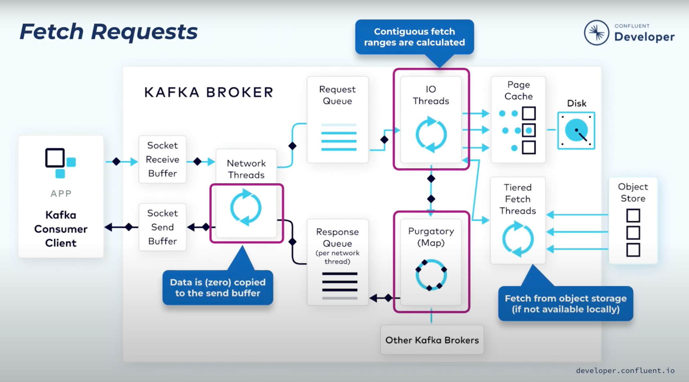

The **zero-copy principle** in Kafka is an optimization technique used to efficiently transfer data between the disk and the network without involving the CPU-intensive copying of data between different memory buffers. 

Traditional Copy: Disk -> Kernel buffer -> application buffer -> kernel buffer for network transmission

Now, Kafka uses zero copy principle as follows,
Disk -> Kernel Buffer -> network socket via syscall sendfile 

### Replication
One replica of each partition will be designated as the leader replica and the broker that holds that replica will be the leader for that partition.
The remaining replicas will be followers. Producers will write to the leader replica and the followers will fetch the data in order to keep in sync with the leader. Consumers also, generally, fetch from the leader replica, but they can be configured to fetch from followers.

The partition leader, along with all of the followers that have caught up with the leader, will be part of the in-sync replica set (ISR).

Each leader is associated with a unique, monotonically increasing number called the **leader epoch**. 
The epoch is used to keep track of what work was done while this replica was the leader and it will be increased whenever a new leader is elected. 
The leader epoch is very important for things like log reconciliation, which we’ll discuss shortly.

Whenever the leader appends new data into its local log, the followers will issue a fetch request to the leader,passing in the offset at which they need to begin fetching.
The leader will respond to the fetch request with the records starting at the specified offset. The fetch response will also include the offset for each record and the current leader epoch.

Sample Fetch Request and Fetch Response:

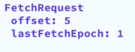,  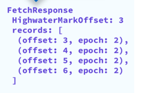 / 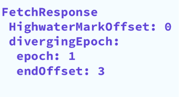

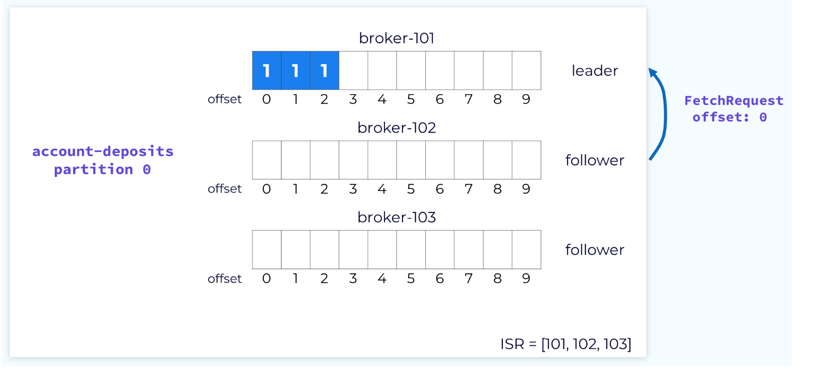
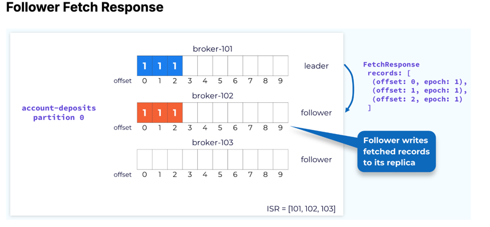

Once all of the followers in the ISR have fetched up to a particular offset, 
the records up to that offset are considered committed and are available for consumers. This is designated by the high watermark.
if a follower sends a fetch request to the leader that specifies offset 3, the leader knows that this follower has committed all records up to offset 3. 
Once all of the followers have reached offset 3, the leader will advance the high watermark accordingly and send it as part of Fetch Response.
The followers’ high watermark will typically lag behind the actual high watermark held by the leader.

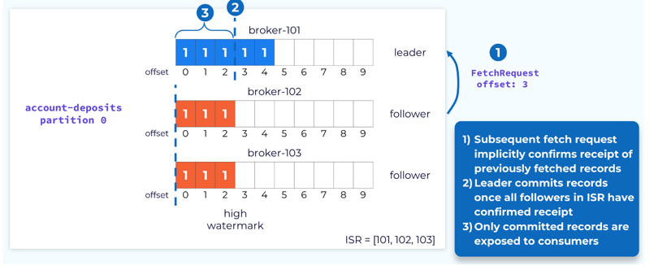

**Handling Leader Failure**

In case of leader failures, Control plane elects a new leader from the ISR set, and the leader epoch will be incremented and the new leader will begin accepting produce requests.
When a new leader is elected, its high watermark could be less than the actual high watermark. If this happens, 
any fetch requests for an offset that is between the current leader’s high watermark and the actual will trigger a retriable OFFSET_NOT_AVAILABLE error.
The consumer will continue trying to fetch until the high watermark is updated, at which point processing will continue as normal.
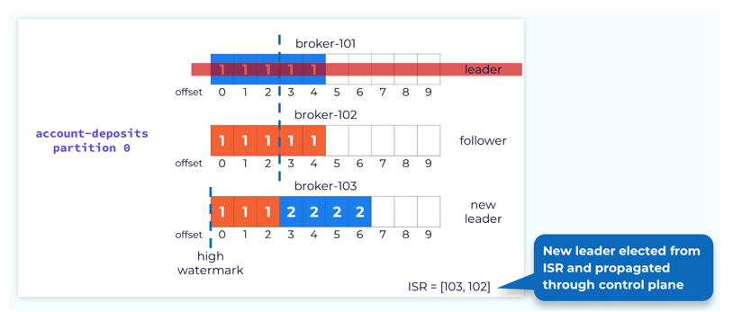
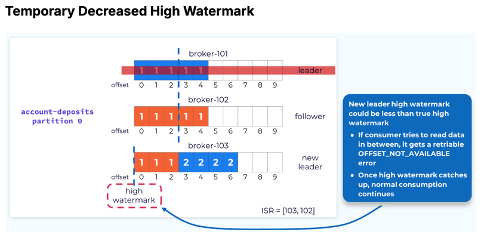

**Reconciliation:** 

Immediately after a new leader election, it is possible that some replicas may have uncommitted records that are out of sync with the new leader.
This is why the leader's high watermark is not current yet. It can’t be until it knows the offset that each follower has caught up to. 
We can’t move forward until this is resolved. This is done through a process called replica reconciliation. 
The first step in reconciliation begins when the out-of-sync follower sends a fetch request. 
In our example, the request shows that the follower is fetching an offset that is higher than the high watermark for its current epoch.

When the leader receives the fetch request it will check it against its own log and determine that the offset being requested is not valid for that epoch.
It will then send a response to the follower telling it what offset that epoch should end at. 
The follower will use the information in the fetch response to truncate the extraneous data so that it will be in sync with the leader.
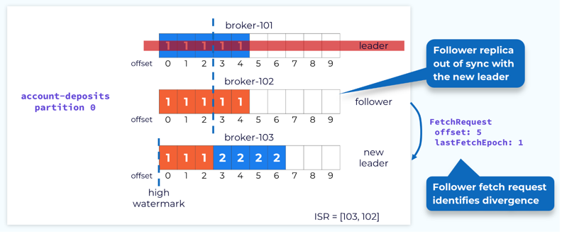
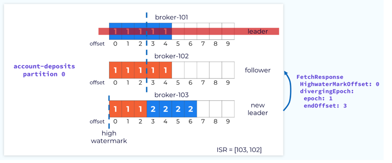
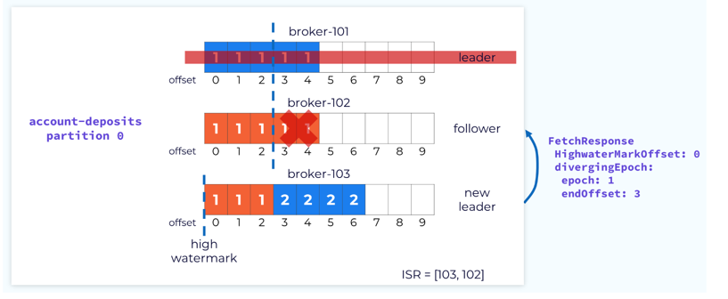
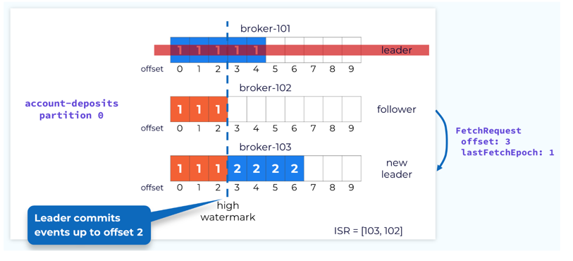
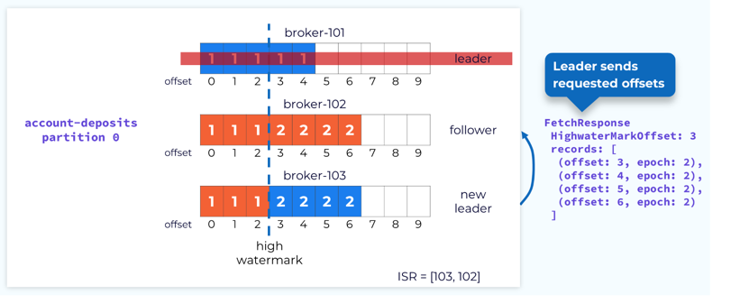
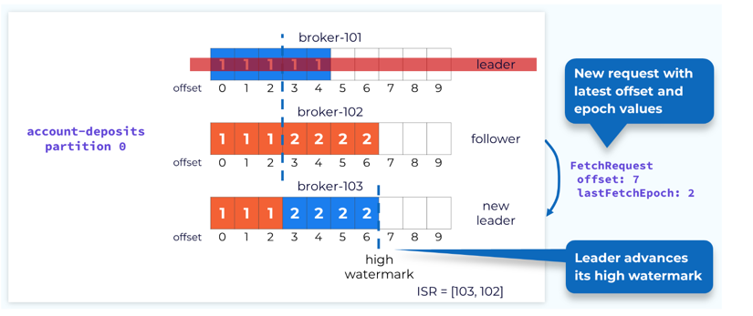
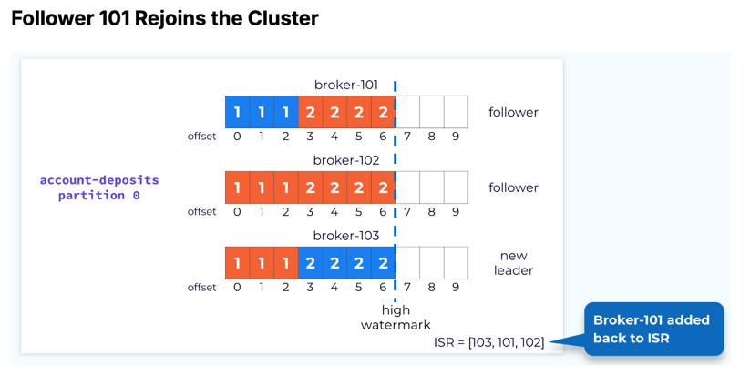

**Handling Failed or Slow Followers**

The leader monitors the progress of its followers. If a configurable amount of time elapses since a follower was last fully caught up, 
the leader will remove that follower from the in-sync replica set. This allows the leader to advance the high watermark so that consumers can continue consuming current data. 
If the follower comes back online or otherwise gets its act together and catches up to the leader, then it will be added back to the ISR.
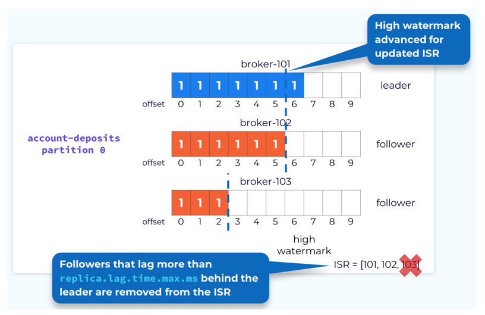

As we’ve seen, the broker containing the leader replica does a bit more work than the follower replicas. 
Because of this it’s best not to have a disproportionate number of leader replicas on a single broker. 
To prevent this Kafka has the concept of a **preferred replica**. 
When a topic is created, the first replica for each partition is designated as the preferred replica. 
Since Kafka is already making an effort to evenly distribute partitions across the available brokers, this will usually result in a good balance of leaders.

As leader elections occur for various reasons, the leaders might end up on non-preferred replicas and this could lead to an imbalance.
So, Kafka will periodically check to see if there is an imbalance in leader replicas. 
It uses a configurable threshold to make this determination. If it does find an imbalance it will perform a leader rebalance to get the leaders back on their preferred replicas.

