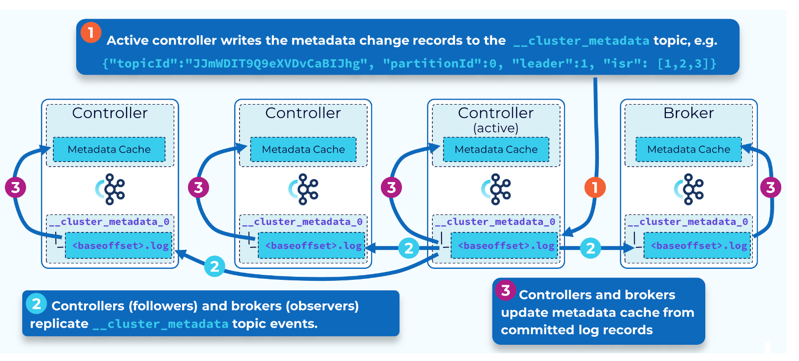
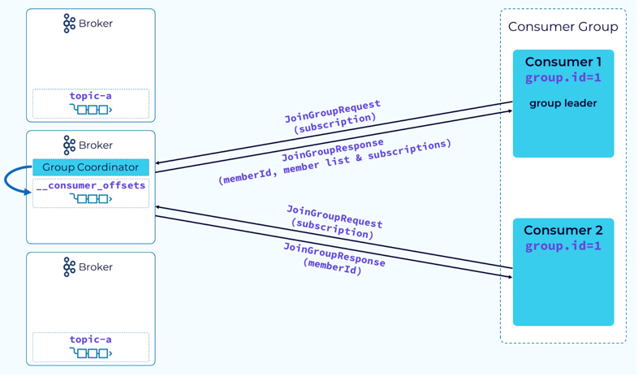

## Architecture

Overview of kafka Architecture


Here is how each event/record looks like, Headers are optional. 
We can add meta data here to headers, to filter the data, custom serialization, debugging, versioning etc


**Kafka Schema Registry** is a centralized service for managing and enforcing schemas for the data (messages) that Kafka producers send to Kafka topics. 
It is part of the Confluent Platform, which is an extension of Apache Kafka. The Schema Registry allows producers to define schemas 
(usually in Avro, JSON Schema, or Protobuf) and ensures that the data sent by producers and consumed by consumers is compliant with these schemas. 

This is how, value looks/gets serialized if we have integrated with schema registry using avro serializer,


Now, Lets look into Kafka Broker,


### Clients Requests

**Produce Request**: 
Producer use a configurable partitioner to determine the topic partition to assign to the record using the key if present.
Sending records one at a time would be inefficient due to the overhead of repeated network requests. So, the producer will accumulate the records assigned to a given partition into batches. 
Batching also provides for much more effective compression, when compression is used. 

Batching is controlled by two properties i.e linger.ms, batch.size. So once enough time or enough data has been accumulated in those record batches, those record batches will be drained, and will form a produce request. 
And this produce request will then be sent to the broker that is the leader of the included partitions.


The request first lands in the broker’s socket receive buffer where it will be picked up by a network thread from the pool. 
That network thread will handle that particular client request through the rest of its lifecycle. 
The network thread will read the data from the socket buffer, form it into a produce request object, and add it to the request queue.

Next, a thread from the I/O thread pool will pick up the request from the queue. 
The I/O thread will perform some validations, including a CRC check of the data in the request. 
It will then append the data to the physical data structure of the partition, which is called a commit log.

On disk, the commit log is organized as a collection of segments. Each segment is made up of several files. 
One of these, a .log file, contains the event data. A second, a .index file, contains an index structure, which maps from a record offset to the position of that record in the .log file.
We also have .timeindex (map timestamps to offsets) , txnindex (used for managing transactional messages, ensuring that messages within a transaction are processed atomically.)

Since the log data is not flushed from the page cache to disk synchronously, Kafka relies on replication to multiple broker nodes, 
in order to provide durability. By default, the broker will not acknowledge the produce request until it has been replicated to other brokers.

To avoid tying up the I/O threads while waiting for the replication step to complete, the request object will be stored in a map-like data structure called purgatory (it’s where things go to wait).

Once the request has been fully replicated, the broker will take the request object out of purgatory, generate a response object, and place it on the response queue.

From the response queue, the network thread will pick up the generated response, and send its data to the socket send buffer. The network thread also enforces ordering of requests from an individual 
client by waiting for all of the bytes for a response from that client to be sent before taking another object from the response queue.


**Fetch Request:**
In order to consume records, a consumer client sends a fetch request to the broker, specifying the topic, partition, and offset it wants to consume. The fetch request goes to the broker’s socket receive buffer where it is picked up by a network thread. The network thread puts the request in the request queue, as was done with the produce request.

The I/O thread will take the offset that is included in the fetch request and compare it with the .index file that is part of the partition segment. 
That will tell it exactly the range of bytes that need to be read from the corresponding .log file to add to the response object.

However, it would be inefficient to send a response with every record fetched, or even worse, when there are no records available. To be more efficient, consumers can be configured to wait for a minimum number of bytes of data, or to wait for a maximum amount of time before returning a response to a fetch request. 
While waiting for these criteria to be met, the fetch request is sent to purgatory.

Once the size or time requirements have been met, the broker will take the fetch request out of purgatory and generate a response to be sent back to the client. The rest of the process is the same as the produce request.


The **zero-copy principle** in Kafka is an optimization technique used to efficiently transfer data between the disk and the network without involving the CPU-intensive copying of data between different memory buffers. 

Traditional Copy: Disk -> Kernel buffer -> application buffer -> kernel buffer for network transmission

Now, Kafka uses zero copy principle as follows,
Disk -> Kernel Buffer -> network socket via syscall sendfile 

### Replication
One replica of each partition will be designated as the leader replica and the broker that holds that replica will be the leader for that partition.
The remaining replicas will be followers. Producers will write to the leader replica and the followers will fetch the data in order to keep in sync with the leader. Consumers also, generally, fetch from the leader replica, but they can be configured to fetch from followers.

The partition leader, along with all of the followers that have caught up with the leader, will be part of the in-sync replica set (ISR).

Each leader is associated with a unique, monotonically increasing number called the **leader epoch**. 
The epoch is used to keep track of what work was done while this replica was the leader and it will be increased whenever a new leader is elected. 
The leader epoch is very important for things like log reconciliation, which we’ll discuss shortly.

Whenever the leader appends new data into its local log, the followers will issue a fetch request to the leader,passing in the offset at which they need to begin fetching.
The leader will respond to the fetch request with the records starting at the specified offset. The fetch response will also include the offset for each record and the current leader epoch.

Sample Fetch Request and Fetch Response:

,   / 


Once all of the followers in the ISR have fetched up to a particular offset, 
the records up to that offset are considered committed and are available for consumers. This is designated by the high watermark.
if a follower sends a fetch request to the leader that specifies offset 3, the leader knows that this follower has committed all records up to offset 3. 
Once all of the followers have reached offset 3, the leader will advance the high watermark accordingly and send it as part of Fetch Response.
The followers’ high watermark will typically lag behind the actual high watermark held by the leader.


**Handling Leader Failure**

In case of leader failures, Control plane elects a new leader from the ISR set, and the leader epoch will be incremented and the new leader will begin accepting produce requests.
When a new leader is elected, its high watermark could be less than the actual high watermark. If this happens, 
any fetch requests for an offset that is between the current leader’s high watermark and the actual will trigger a retriable OFFSET_NOT_AVAILABLE error.
The consumer will continue trying to fetch until the high watermark is updated, at which point processing will continue as normal.


**Reconciliation:** 

Immediately after a new leader election, it is possible that some replicas may have uncommitted records that are out of sync with the new leader.
This is why the leader's high watermark is not current yet. It can’t be until it knows the offset that each follower has caught up to. 
We can’t move forward until this is resolved. This is done through a process called replica reconciliation. 
The first step in reconciliation begins when the out-of-sync follower sends a fetch request. 
In our example, the request shows that the follower is fetching an offset that is higher than the high watermark for its current epoch.

When the leader receives the fetch request it will check it against its own log and determine that the offset being requested is not valid for that epoch.
It will then send a response to the follower telling it what offset that epoch should end at. 
The follower will use the information in the fetch response to truncate the extraneous data so that it will be in sync with the leader.


**Handling Failed or Slow Followers**

The leader monitors the progress of its followers. If a configurable amount of time elapses since a follower was last fully caught up, 
the leader will remove that follower from the in-sync replica set. This allows the leader to advance the high watermark so that consumers can continue consuming current data. 
If the follower comes back online or otherwise gets its act together and catches up to the leader, then it will be added back to the ISR.


As we’ve seen, the broker containing the leader replica does a bit more work than the follower replicas. 
Because of this it’s best not to have a disproportionate number of leader replicas on a single broker. 
To prevent this Kafka has the concept of a **preferred replica**. 
When a topic is created, the first replica for each partition is designated as the preferred replica. 
Since Kafka is already making an effort to evenly distribute partitions across the available brokers, this will usually result in a good balance of leaders.

As leader elections occur for various reasons, the leaders might end up on non-preferred replicas and this could lead to an imbalance.
So, Kafka will periodically check to see if there is an imbalance in leader replicas. 
It uses a configurable threshold to make this determination. If it does find an imbalance it will perform a leader rebalance to get the leaders back on their preferred replicas.

**Durability:**

A producer sends a produce request to the partition leader, when should the leader send the ack to the producer so that our data is durable and our system is highly available

if we set 

acks config value to zero -> then producer doesn;t wait for any leader response at all

acks config value to one -> then producer sends response as soon the data is written in its commit log. But what if the leader goes down immediately ?

acks config value set to all -> Now producer sends ok only after all followers have the data, but this will take more time (2.5x) and what if one follower node is down, producer will not accept any requests now

min.insync.replica config lets us decide what should be the min isr set size before leader sends ok to producer. 

So, with replication set to 5, min isr to 3 and ack=all, we can accept requests from producer even if two brokers are down and data is still available in 3 nodes.

**Producer Idempotence and ordering Guarantee**

Leader broker failures can cause duplicate events to be written to the partition which will throw off the ordering. In order to solve this, we need to enable idempotence (enable.idempotence = true)

By enabling this, brokers will also get Pid, seq no details. So, before adding logs/data broker can check if this out of seq or not for the given PId


Combining acks=all, producer idempotence, and keyed events results in a powerful end-to-end ordering guarantee. Events with a specific key will always land 
in a specific partition in the order they are sent, and consumers will always read them from that specific partition in that exact order.


## Control Plane

Old ZooKeeper Design:

The Kafka control plane was managed through an external consensus service called ZooKeeper. 
One broker is designated as the controller. The controller is responsible for communicating with ZooKeeper and the other brokers in the cluster. 
The metadata for the cluster is persisted in ZooKeeper.


With the release of Apache Kafka 3.3.1 in October 2022, Raft based consensus protocol for metadata management, called KRaft, has been marked as production ready. 
Running Kafka in Kraft mode eliminates the need to run a Zookeeper cluster alongside every Kafka cluster.

In KRaft, a subset of brokers are designated as controllers, and these controllers provide the consensus services that used to be provided by ZooKeeper. 
All cluster metadata are now stored in Kafka topics and managed internally.  
One of the controller brokers will be the active controller and it will handle communicating changes to metadata with the other brokers.


We got two options with KRaft mode, i.e. dedicated controller node or shared node
```aidl
process.roles=controller or broker or both
controller.quorum.voters // list of controller nodes set in all brokers
```


All of the controller brokers maintain an in-memory metadata cache that is kept up to date, so that any controller can take over as the active controller if needed. 
This is one of the features of KRaft that make it so much more efficient than the ZooKeeper-based control plane.

cluster metadata, reflecting the current state of all controller managed resources, is stored in a single partition Kafka topic called __cluster_metadata. 
KRaft uses this topic to synchronize cluster state changes across controller and broker nodes.
rather than the controller broadcasting metadata changes to the other controllers or to brokers, 
they each fetch the changes. This makes it very efficient



Data replication and reconciliation of this meta data topic is very similar to that of data plane topic replication.
when a leader needs to be elected, this is done via quorum, rather than an in-sync replica set.
Another difference is that metadata records are flushed to disk immediately as they are written to each node’s local log.
Leader Election process,


**KRaft Cluster Metadata Snapshot**

In KRaft mode, Kafka brokers take periodic snapshots of the metadata cache and store them on disk. Also we don’t want the metadata log to grow endlessly.
By taking snapshot, Now we know that all data in the metadata log that is older than that offset and epoch is safely stored, and the log can be truncated up to that point.
The snapshot, together with the remaining data in the metadata log, will still give us the complete metadata for the whole cluster.
These snapshots are used to speed up the recovery process and to avoid replaying all the log entries from the __cluster_metadata topic when a broker restarts.
Kafka typically uses the number of snapshots (metadata.snapshot.retention.num) to determine when to delete old snapshots

Two primary uses of the metadata snapshot are broker restarts and new brokers coming online.

When an existing broker restarts, it 
1. Loads its most recent snapshot into memory.  
2. Then starting from the EndOffset of its snapshot, it adds available records from its local __cluster_metadata log. 
3. It then begins fetching records from the active controller. If the fetched record offset is less than the active controller LogStartOffset, the controller response includes the snapshot ID of its latest snapshot. 
4. The broker then fetches this snapshot and loads it into memory and then once again continues fetching records from the __cluster_metadata partition leader (the active controller).


## Consumer Group

The magic behind consumer groups is provided by the group coordinator. The group coordinator helps to distribute the data in the subscribed topics to the consumer group instances evenly 
and it keeps things balanced when group membership changes occur. 
The coordinator uses an internal Kafka topic to keep track of group metadata.
In a typical Kafka cluster, there will be multiple group coordinators. This allows for multiple consumer groups to be managed efficiently.

**Group StartUp:**

1. **Find the Group Co-ordinator:** When a consumer instance starts up it sends a FindCoordinator request that includes its group.id to any broker in the cluster. 
The broker will create a hash of the group.id and modulo that against the number of partitions in the internal __consumer_offsets topic. That determines the partition that all metadata events for this group will be written to. 
The broker that hosts the leader replica for that partition will take on the role of group coordinator for the new consumer group. The broker that received the FindCoordinator request will respond with the endpoint of the group coordinator.

**Note:** The __consumer_offsets topic is a log-compacted topic. This means that older offset records for the same consumer group and partition are eventually removed
offsets.topic.num.partitions config determines number of partitions for that topic.
consumer will issue a CommitOffsetRequest to the group coordinator. The coordinator will then persist that information in its internal __consumer_offsets topic.


2. **Members Join:**

the consumers and the group coordinator begin a little logistical dance, starting with the consumers sending a JoinGroup request and passing their topic subscription information. 
The coordinator will choose one consumer, usually the first one to send the JoinGroup request, as the **group leader**. The coordinator will return a memberId to each consumer, but it will also return a list of all members and the subscription info to the group leader. 
The reason for this is so that the group leader can do the actual partition assignment using a **configurable partition assignment strategy**.



3. **Partitions Assigned**

After the group leader receives the complete member list and subscription information, it will use its configured partitioner to assign the partitions in the subscription to the group members.
With that done, the leader will send a SyncGroupRequest to the coordinator, passing in its memberId and the group assignments provided by its partitioner. 
The other consumers will make a similar request but will only pass their memberId. The coordinator will use the assignment information given to it by the group leader to return the actual assignments to each consumer. Now the consumers can begin their real work of consuming and processing data.


**Range Partition Assignment Strategy**

1. **Range assignment strategy:**  

This strategy goes through each topic in the subscription and assigns each of the partitions to a consumer, starting at the first consumer. What this means is that the first partition of each topic will be assigned to the first consumer, the second partition of each topic will be assigned to the second consumer, and so on. If no single topic in the subscription has as many partitions as there are consumers, then some consumers will be idle.


2. **Round Robin and Sticky Partition Assignment Strategies**

this strategy, all of the partitions of the subscription, regardless of topic, will be spread evenly across the available consumers. This results in fewer idle consumer instances and a higher degree of parallelism.

A variant of Round Robin, called the Sticky Partition strategy, operates on the same principle but it makes a best effort at sticking to the previous assignment during a rebalance. This provides a faster, more efficient rebalance.


3. **CooperativeSticky Assignment Strategy:** 

A variant of the StickyAssignor that supports incremental cooperative rebalancing, where consumers can join and leave without triggering a full rebalance 
i.e. when a consumer goes down, it doesnt immediately trigger rebalance, it waits for some time (config property) and if it joins back, it gets its partitions back

When a consumer rejoins, it will send an OffsetFetchRequest to the group coordinator to retrieve the last committed offset for its assigned partition. Once it has the offset, it will resume the consumption from that point.

If its joining newly, then the auto.offset.reset configuration will determine whether it begins consuming from the earliest offset or the latest.

**Note:** If different clients of the same consumer provides different strategy, then Kafka consumer group coordinator will enforce one strategy across the group.
It is advised though that, all provide same strategy


**Consumer Group Rebalance Triggers**

Group Rebalance can be triggered in below scenarios,
* An instance fails to send a heartbeat to the coordinator before the timeout and is removed from the group
* An instance has been added to the group
* Partitions have been added to a topic in the group’s subscription
* A group has a wildcard subscription and a new matching topic is created
* And, of course, initial group startup

The re balance process begins with the coordinator notifying the consumer instances that a rebalance has begun. 
It does this by piggybacking on the HeartbeatResponse or the OffsetFetchResponse.

 partition.assignment.strategy config lets us select appropriate strategy


**Stop-the-World Rebalance:**

The Stop-the-World Rebalance strategy in Kafka refers to a traditional approach to rebalancing where all consumers in a group are paused during a rebalance.
This strategy is typically associated with the default rebalancing strategies like RangeAssignor or RoundRobinAssignor.


**Note:** Partition state for a consumer generally includes The current position in the partition, Messages that have been fetched but not yet processed or committed
,  Any in-memory data or cache related to the processing of the partition, Offsets that have been processed but not yet committed.

We have two problems with this approach,
1. Rebuilding state
2. Processing Paused

Avoid Needless State Rebuild with StickyAssignor


Avoid Pause with CooperativeStickyAssignor


Avoid Rebalance with Static Group Membership:

With static group membership each consumer instance is assigned a group.instance.id. Also, when a consumer instance leaves gracefully it will not send a LeaveGroup request to the coordinator, 
so no rebalance is started. When the same instance rejoins the group, 
the coordinator will recognize it and allow it to continue with its existing partition assignments. Again, no rebalance needed.


### Questions:
Do we still use zero copy principle in case we don't have enough data to send for consumer request? 
As there was a mention of purgatory map incase data is not ready or enough.

Quick question in case of leader failure, 
lets say we set min ISR to 2 and replica factor set to 3.
Now, follower 1 is fully caught up with leader and follower2 is just lagging behind with maybe 3-4 of records(< replica.lag.time.max.ms) , as min ISR is set to 2, leader has advanced the high watermark i.e. committed the records.
Now if the leader fails, and follower 2 is elected as the new leader and starts accepting the produce requests.
Now How does the Reconciliation happen and what happens to the records that weren't caught by initial follower 2 i.e. new leader


I have an application which reads data from topic1 and after processing the event from topic1 it needs to publish data to topic2 and topic3. 
I want this entire reading, processing and writing to two topic to be in a transaction. 
How can i do this in kafka using its transaction and how will the consumers of topic2 and topic3 read with isolation level set as read_comitted as 
we have events to topic2 and topic3 from various similar application instances processing the data from topic1

is transaction.id and PID 1:1 mapping ? What happens if a single instance is doing multiple transactions on various threads ?
Doesnt all the transactions logs go to the same partition of the __transaction_state topic 


